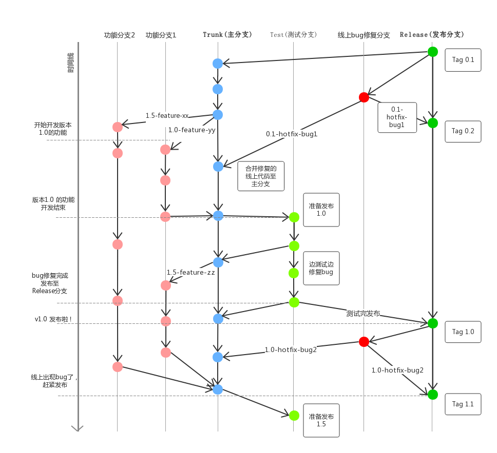

# 开发流程与代码规范

## 开发流程

### 仓库

托管在码云私有仓库上， see: https://gitee.com/

### 分支管理



### 提交流程

> 参见教程: http://www.ruanyifeng.com/blog/2016/01/commit_message_change_log.html

```bash
git add YOUR_EDITED_FILES
git cz
git push
```

#### 安装 commitizen

commitizen, 可以实现提交提示可视化， see: https://github.com/commitizen/cz-cli  
提交内容主要分为以下几个方面

```bash
feat：新功能（ feature ）
fix：修补bug
docs：文档（ documentation ）
style： 格式（ 不影响代码运行的变动 ）
refactor：重构（ 即不是新增功能，也不是修改bug的代码变动 ）
test：增加测试
chore：构建过程或辅助工具的变动
```

```bash
 npm install -g commitizen
 commitizen init cz-conventional-changelog --save --save-exact
```

添加 [`.vcmrc`](../.vcmrc)

#### 安装 conventional-changelog

基于这个工具可以自动生成 changelog , 前提是得按照标准的格式书写 commit message  
see: https://github.com/conventional-changelog/conventional-changelog

```bash
npm install -g conventional-changelog
```

在本脚手架中，可以直接使用 npm 命令执行

```bash
npm run changelog
```

#### commitlint

https://github.com/marionebl/commitlint

#### 安装 validate-commit-msg（ DEPRECATED 使用 commitlint 即可）

基于这个工具可以验证提交消息的格式是否规范, 阮博士教程中安装方式有点过时，具体使用可以
see: https://github.com/conventional-changelog-archived-repos/validate-commit-msg

```bash
npm install --save-dev validate-commit-msg
```

## 代码规范

### 业界参考

- JavaScript 代码规范, 参见业界公认的 airbnb 规范: https://github.com/airbnb/javascript
- Angular 规范，直接参考官网: https://angular.io/guide/styleguide , 默认已集成部分检测工具， 如 `tslint-angular`，手动检测可以执行命令 `npm run lint`

### 工具

这里囊括一些已经用到或者以后需要用到的一些工具

### codelyzer

see: https://github.com/mgechev/codelyzer

```bash
npm i tslint-angular
```

### ionic docker

see: https://github.com/marcoturi/ionic-docker

### type doc

自动根据注释生成文档的工具， see: https://github.com/TypeStrong/typedoc/

### better-npm-run

能够去除配置文件硬编码
see: https://github.com/benoror/better-npm-run

### scsslint

https://sass-guidelin.es/#tools
